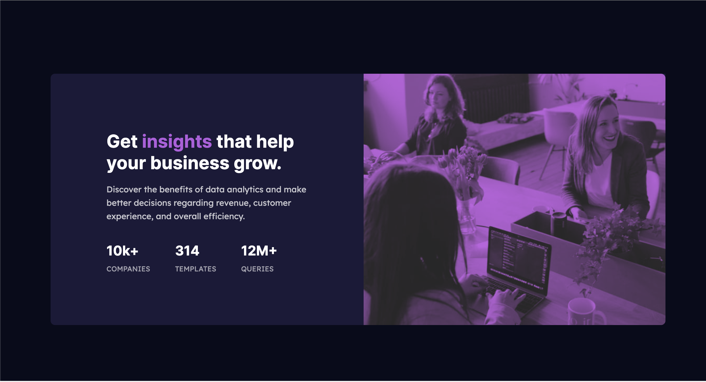

# Frontend Mentor - Stats preview card component solution

This is a solution to the [Stats preview card component challenge on Frontend Mentor](https://www.frontendmentor.io/challenges/stats-preview-card-component-8JqbgoU62). Frontend Mentor challenges help you improve your coding skills by building realistic projects. 

## Table of contents

- [Overview](#overview)
  - [The challenge](#the-challenge)
  - [Screenshot](#screenshot)
  - [Links](#links)
- [My process](#my-process)
  - [Built with](#built-with)
  - [What I learned](#what-i-learned)
  - [Continued development](#continued-development)
  - [Useful resources](#useful-resources)
- [Author](#author)


## Overview

### The challenge

Users should be able to:

- View the optimal layout depending on their device's screen size

### Screenshot





### Links

- Solution URL: [https://ajtw7.github.io/Stats-Preview-Card/]

## My process

My process was fairly simple. I built out the HTML structure first and then proceeded to the CSS portion of the challenge.
As far as design, I leaned on CSS Flexbox, as thats what I'm most confortable with. 

### Built with

- Semantic HTML5 markup
- CSS custom properties
- Flexbox
- Mobile-first workflow


### What I learned

Im proud of the piece of code below, specifically the "box-sorting" property. 
Before I thought to use it, I was having trouble fitting each box inside another, particularly the stat-container.

I didn't realize my screen was zoomed in, the actual design is bigger than the mockup. Moving forward, I'll have to be more conscientious about the size of my preview.

To see how you can add code snippets, see below:


```
.main-copy {
    display: flex;
    width: 100%;
    box-sizing: border-box;
    flex-direction: column;
    text-align: center;
    padding: 0 32px;
    margin: 0px auto;
}

```


### Continued development

In my future projects, I'd like to use more libraries to speed up my workout and also use some other design techniques besides flexbox.


### Useful resources

- [W3 Schools CSS Filters](https://www.w3schools.com/howto/howto_css_image_effects.asp) - This site was very useful to me because I wasn't sure how I'd get a black/white image to have purple hue. It required a lot of trial and error. Eventually it worked out.


## Author

- Frontend Mentor - [@ajtw7](https://www.frontendmentor.io/profile/ajtw7)


